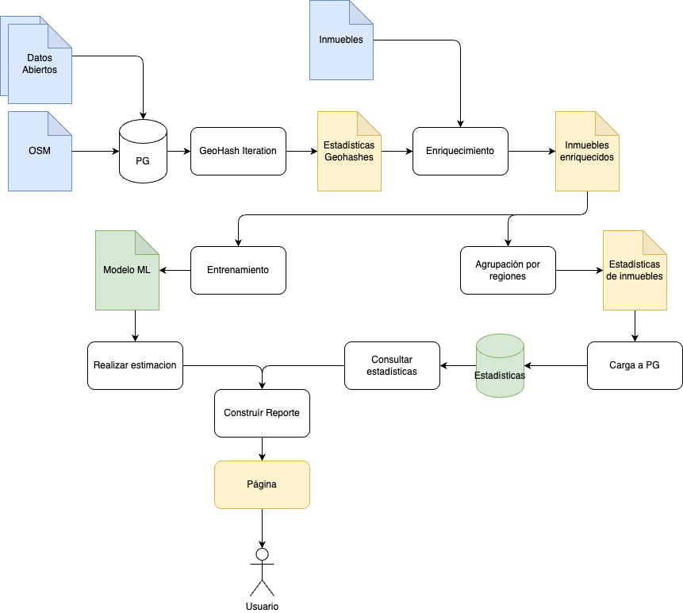

# Indexador de datos
Este es un proyecto de backend que se encarga de procesar los datos geograficos, hacer calculos y prepararlos
para ser consultados por el cliente en el futuro.

## Pipeline

El pipeline funciona de la siguiente manera:

### Estádisticas de GeoHash

En este proceso se busca calcular los puntos cercanos a un geohash en espécifico, el proceso comienza por definir un nivel de geohash a calcular, luego se agrega un nivel más abajo de forma recursiva para calcular las estadisticas para el geohash al nivel deseado.

## Enriquecimiento de inmuebles

A partir de los datos precalculados por geohash, se toma cada uno de los inmuebles y se enriquece con la información calculada para el geohash donde la propiedad se encuentra.

### Estadísticas de localidad/barrio/upz

